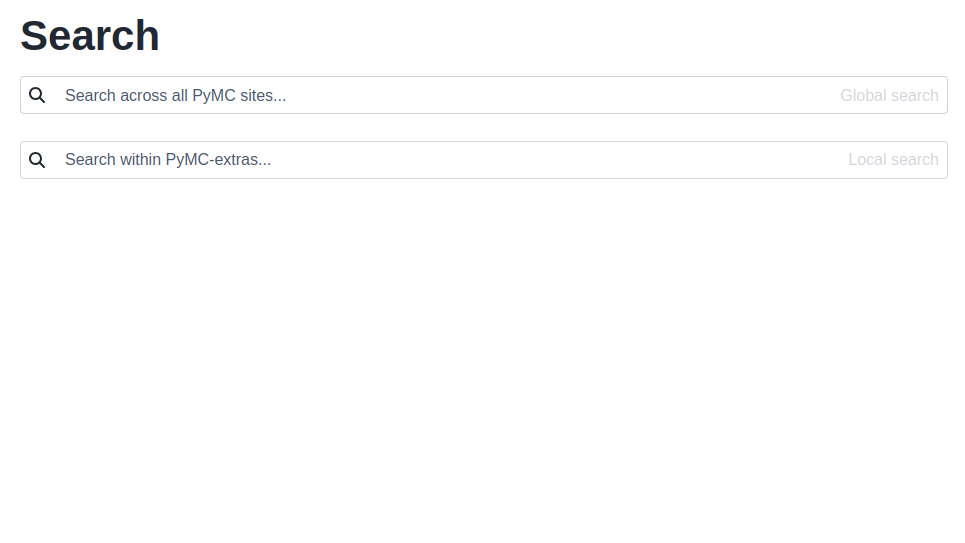
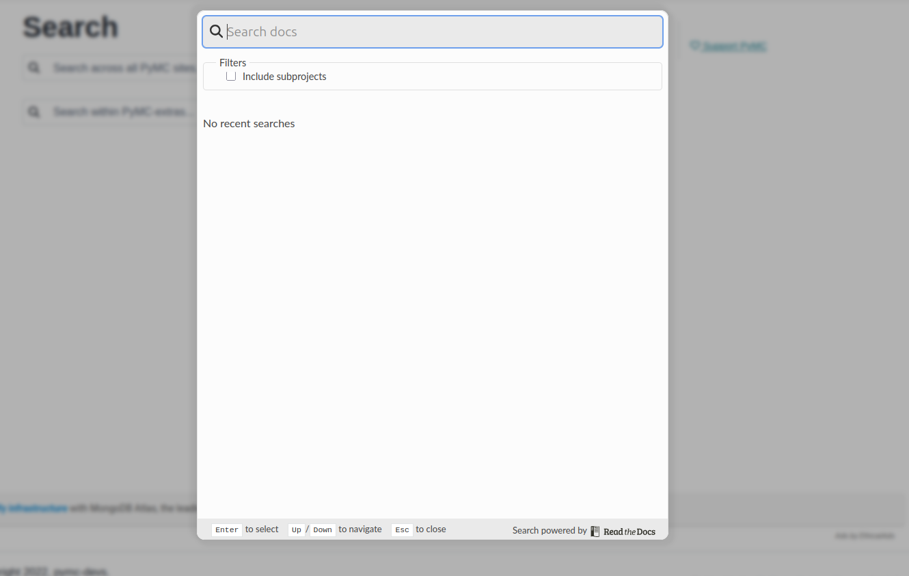

# pymc-sphinx-theme

A thin sphinx theme to customize [pydata-sphinx-theme](https://pydata-sphinx-theme.readthedocs.io) (PST) consistently cross PyMC websites.

## Theme customizations

### Custom search page
PyMC docs are organized as subprojects in readthedocs. The custom search page shows two
search bars, one that triggers the readthedocs search function of the parent project
and that allows searching accross subprojects, and the PST one for local search
within that particular project only.

### Centralize navbar customization
The version indicator by the logo/project name is added as well as the mastodon, twitter,
youtube and discord icon links. If no icon links are provided by the specific project,
an extra link to the GitHub org is added, otherwise the project provided links are extended
with the four mentioned.

### Extra right sidebar elements
An extra "Support PyMC" link to the NumFOCUS donation page is automatically added,
and the template of the "Edit on GitHub" link is modified so it is not shown in API pages that
are generated from a docstring. The logic of this exclusion is extremely simple, as we use
`:toctree: generated/` as autosummary option, pages with "generated" in their path are excluded.
